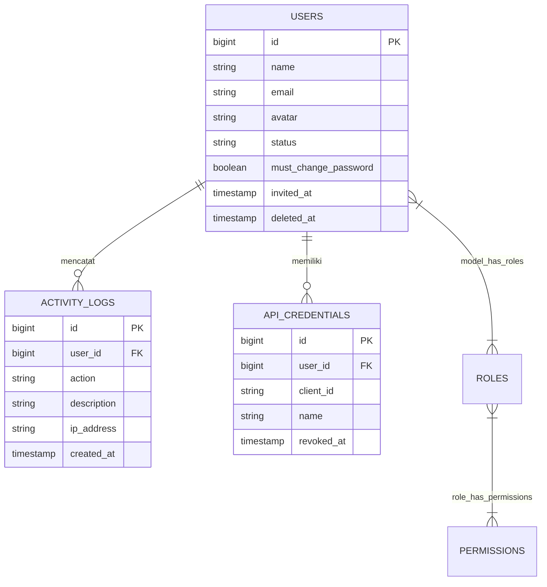

<p align="center"><a href="https://laravel.com" target="_blank"></a></p>

<p align="center">
<a href="https://laravel.com"></a>
<a href="https://vuejs.org"></a>
<a href="https://inertiajs.com"></a>
<a href="https://tailwindcss.com"></a>
<a href="https://docker.com"></a>
</p>

---

# 🚀 Starter Template CMS Vue (Laravel 13 + Inertia v3)

Template starter-kit CMS profesional berbasis **Laravel 13**, **Inertia.js v3**, dan **Vue 3 (Composition API)**. Didesain siap pakai untuk proyek enterprise dengan manajemen akses berbasis role (RBAC), fitur ekspor-impor data, Docker development & production setup, serta terintegrasi penuh dengan **Laravel Boost & Agentic AI Coding Tools**.

---

## 📑 Daftar Isi
- [Fitur Utama](#-fitur-utama)
- [Persyaratan Sistem](#-persyaratan-sistem)
- [Development Setup (Docker)](#-development-setup-docker)
- [API Proof of Concept & Swagger Documentation](#-api-proof-of-concept--swagger-documentation)
- [Penggunaan & Fitur AI Agent (Laravel Boost)](#-penggunaan--fitur-ai-agent-laravel-boost)
  - [Instalasi Boost di Docker](#1-instalasi--instalasi-ulang-boost-di-docker)
  - [Konfigurasi MCP Server (`mcp.json`)](#2-konfigurasi-mcp-server-mcpjson)
  - [Pembaruan Guidelines AI (`artisan boost:update`)](#3-pembaruan-guidelines-ai-artisan-boostupdate)
- [Testing Setup & Execution (.env.testing)](#-testing-setup--execution-envtesting)
  - [Persiapan File Environment Testing](#1-persiapan-file-environment-testing)
  - [Strategi Database Testing (Senior QA & Backend Standard)](#2-strategi-database-testing-senior-qa--backend-standard)
  - [Menjalankan Testing di Docker Container](#3-menjalankan-testing-di-docker-container)
- [Production Deployment](#-production-deployment)
- [Command Cheat Sheet](#-command-cheat-sheet)
- [Lisensi](#-lisensi)

---

## ✨ Fitur Utama

- **Architecture**: Laravel 13 (PHP 8.3) + Inertia.js v3 SPA tanpa kompleksitas API terpisah.
- **Frontend Stack**: Vue 3 (`<script setup>`), Vite, dan Tailwind CSS v4.
- **Role & Permission Management**: Integrasi Spatie `laravel-permission` (Roles, Permissions, & `super_admin` bypass).
- **API Proof of Concept**: Public/Private API versioned, Sanctum Bearer Token 1 jam, API credential Super Admin, dan Swagger/OpenAPI.
- **Data Export & Import**: Siap pakai dengan `maatwebsite/excel` (Excel/CSV) & `barryvdh/laravel-dompdf` (PDF Export).
- **Isolated Docker Setup**: Containerization terpisah untuk Development (`compose.dev.yaml`) & Production (`compose.prod.yaml`). Database MySQL berjalan terpisah dari container.
- **Agentic AI Native Ready**: Terintegrasi langsung dengan **Laravel Boost (MCP Server)**, rules terstruktur (`.ai/rules`), dan Agent Skills (`.agents/skills/`) untuk akselerasi coding berbasis AI (Antigravity, Cursor, Claude Code, Copilot).

---

## 🔌 API Proof of Concept & Swagger Documentation

### 📚 Swagger UI API Documentation
Dokumentasi interaktif Swagger UI dapat diakses di browser pada URL:
👉 **[http://localhost:8000/api/documentation](http://localhost:8000/api/documentation)**

### 🌐 API Endpoints (v1)

Base URL: `http://localhost:8000`

| Method | Endpoint | Authentication | Keterangan |
|---|---|---|---|
| **GET** | `http://localhost:8000/api/v1/public/check` | Tidak perlu | Verifikasi Public API |
| **POST** | `http://localhost:8000/api/v1/auth/token` | `client_id` + `client_secret` | Menerbitkan Sanctum Bearer Token (Berlaku 1 jam) |
| **GET** | `http://localhost:8000/api/v1/private/check` | Header: `Bearer Token` | Verifikasi Private API |

### 🔄 Flow Autentikasi API Step-by-Step

1. **Buat Kredensial API**: Super Admin membuka menu **API Credentials** (`http://localhost:8000/api-credentials`) di CMS untuk membuat `client_id` dan `client_secret`.
2. **Terbitkan Token (`POST /api/v1/auth/token`)**:
   Kirim request dengan body JSON:
   ```json
   {
     "client_id": "YOUR_CLIENT_ID",
     "client_secret": "YOUR_CLIENT_SECRET"
   }
   ```
   Response akan mengembalikan `access_token` (Sanctum Bearer Token yang berlaku selama 1 jam).
3. **Gunakan Token pada Request Private**:
   Sertakan token pada HTTP Header `Authorization`:
   ```http
   Authorization: Bearer <access_token_anda>
   ```

Super Admin dapat mencabut (*revoke*) credential kapan saja melalui CMS, yang secara otomatis membatalkan seluruh Bearer Token aktif terkait.

### 🚀 Cara Inisialisasi & Regenerasi Swagger UI

Setelah container development aktif, jalankan perintah berikut dari host machine:

```bash
# 1. Terapkan migration Sanctum dan API credential
docker compose -f compose.dev.yaml exec app php artisan migrate

# 2. Generate spesifikasi OpenAPI untuk Swagger UI
docker compose -f compose.dev.yaml exec app php artisan l5-swagger:generate

# 3. Jalankan test POC API
docker compose -f compose.dev.yaml exec app php artisan test --compact tests/Feature/ApiCredentialApiTest.php
```

> 💡 **Catatan Regenerasi Swagger:** Setiap kali Anda menambahkan API endpoint baru atau memperbarui annotasi OpenAPI/Swagger pada controller, jalankan kembali perintah `docker compose -f compose.dev.yaml exec app php artisan l5-swagger:generate` agar dokumentasi Swagger UI (`storage/api-docs/api-docs.json`) diperbarui secara otomatis.

Setelah spesifikasi OpenAPI digenerate, buka **[http://localhost:8000/api/documentation](http://localhost:8000/api/documentation)** di browser. Dapatkan token dari endpoint `/api/v1/auth/token`, klik tombol **Authorize** di kanan atas Swagger UI, paste token tersebut, lalu jalankan Private API (`/api/v1/private/check`).

---

## ⚙️ Persyaratan Sistem

- **Docker** & **Docker Compose**
- **Node.js** `>= 18.x` & **NPM** (untuk frontend dev di host machine)
- **MySQL** `>= 8.0` (berjalan di host local atau database server terpisah)

---

## 🛠️ Development Setup (Docker)

Database berada di luar Docker container. Container Docker hanya menjalankan runtime PHP/Laravel.

### 1. Persiapan Database & File `.env`
Buat database MySQL di host machine:
```bash
mysql -u root -p -e "CREATE DATABASE IF NOT EXISTS sample_template_cms_vue;"
```

Pastikan variabel database pada file `.env` terisi dengan benar:
```env
DB_CONNECTION=mysql
DB_HOST=127.0.0.1
DB_PORT=3306
DB_DATABASE=sample_template_cms_vue
DB_USERNAME=root
DB_PASSWORD=
```
> 💡 *Catatan:* `compose.dev.yaml` otomatis mengalihkan `DB_HOST` menjadi `host.docker.internal` secara internal di dalam container agar terhubung ke MySQL host. **Jangan ubah `DB_HOST=127.0.0.1` di file `.env`.**

### 2. Jalankan Docker Container Development
```bash
# 1. Jalankan container di background
docker compose -f compose.dev.yaml up -d --build

# 2. Jalankan migrasi database & Inisialisasi Role
docker compose -f compose.dev.yaml exec app php artisan migrate

# 3. Buat symlink upload publik untuk avatar/file public
docker compose -f compose.dev.yaml exec app php artisan storage:link

# 4. Inisialisasi permissions, role, & buat akun Super Admin
docker compose -f compose.dev.yaml exec app php artisan role:init
```
*(Atau gunakan opsi `--name`, `--email`, `--password` untuk eksekusi non-interaktif)*

### 3. Jalankan Frontend Vite (Host Machine)
Buka terminal baru di mesin local dan jalankan Vite dev server:
```bash
npm install
npm run dev
```

Akses aplikasi di browser: **`http://localhost:8000`**  
*(Vite HMR akan aktif di `http://localhost:5173`)*

Untuk menghentikan container development:
```bash
docker compose -f compose.dev.yaml down
```

---

## 🤖 Penggunaan & Fitur AI Agent (Laravel Boost)

Proyek ini telah dikonfigurasi agar AI Coding Agents (seperti **Antigravity**, **Cursor**, **Claude Code**, **Copilot**) dapat bekerja dengan sangat presisi dan memahami konvensi aplikasi secara otomatis.

### 1. Instalasi & Instalasi Ulang Boost di Docker

Jika perlu melakukan setup/reset Laravel Boost di Docker:
```bash
# Install package composer Boost
docker compose -f compose.dev.yaml exec app composer require laravel/boost --dev

# Jalankan installer interaktif
docker compose -f compose.dev.yaml exec app php artisan boost:install
```

> **💡 Tips Navigasi Terminal Interaktif (Laravel Prompts):**
> - **`↑` / `↓`**: Pindah opsi pilihan.
> - **`Spacebar`**: Centang / hapus centang opsi (`◼` / `◻`).
> - **`a`**: Pilih semua opsi (*Select All*).
> - **`ENTER`**: Konfirmasi dan lanjut.

### 2. Konfigurasi MCP Server (`mcp.json`)

Agar AI Editor/Agent pada host machine dapat menggunakan tool MCP dari dalam container Docker, tambahkan konfigurasi berikut pada `mcp.json` editor Anda:

```json
{
  "mcpServers": {
    "laravel-boost": {
      "command": "docker",
      "args": [
        "compose",
        "-f",
        "compose.dev.yaml",
        "exec",
        "-i",
        "app",
        "php",
        "artisan",
        "boost:mcp"
      ]
    }
  }
}
```
*Flag `-i` wajib ada agar komunikasi `stdin`/`stdout` antara AI Agent di host dan container Docker berjalan lancar.*

### 3. Pembaruan Guidelines AI (`artisan boost:update`)

Ketika Anda menambahkan package baru, mengubah struktur folder, atau menambah aturan proyek:
```bash
# Refresh AI guidelines & skills di repositori
docker compose -f compose.dev.yaml exec app php artisan boost:update
```

---

## 🧪 Testing Setup & Execution (.env.testing)

Aplikasi ini menggunakan konfigurasi environment khusus pengujian melalui `.env.testing` dan `.env.testing.example` untuk memastikan isolasi penuh antara data pengujian dan database development lokal/production.

### 1. Persiapan File Environment Testing
Salin file `.env.testing.example` menjadi `.env.testing`:
```bash
cp .env.testing.example .env.testing
```
*Catatan:* File `.env.testing` telah secara otomatis dimasukkan ke `.gitignore` agar opsi testing lokal setiap pengembang tidak bentrok di repositori.

### 2. Strategi Database Testing (Senior QA & Backend Standard)

Terdapat dua pendekatan strategi database untuk pengujian:

1. **Opsi 1: Fast In-Memory SQLite (Default & Recommended for CI/Fast Feedback)**
   - Performa super cepat (eksekusi test di RAM tanpa I/O disk).
   - Tanpa perlu setup database tambahan di MySQL.
   - Konfigurasi di `.env.testing`:
     ```env
     DB_CONNECTION=sqlite
     DB_DATABASE=:memory:
     ```

2. **Opsi 2: Dedicated MySQL Test Database (Full MySQL Feature Parity)**
   - Digunakan jika terdapat feature test yang memerlukan spesifik fitur MySQL (misal: JSON column querying, stored procedure, atau raw MySQL query).
   - Buat database khusus testing di MySQL host:
     ```bash
     mysql -u root -p -e "CREATE DATABASE IF NOT EXISTS sample_template_cms_vue_test;"
     ```
   - Sesuaikan `.env.testing` untuk menggunakan MySQL:
     ```env
     DB_CONNECTION=mysql
     DB_HOST=127.0.0.1
     DB_PORT=3306
     DB_DATABASE=sample_template_cms_vue_test
     DB_USERNAME=root
     DB_PASSWORD=
     ```
     *(Di dalam Docker container `compose.dev.yaml`, `DB_HOST` otomatis dialihkan ke `host.docker.internal`)*

### 3. Best Practice Testing Configuration
- **Hashing Speedup (`BCRYPT_ROUNDS=4`)**: Mengurangi alokasi waktu hashing password saat membuat dummy user dengan factory.
- **State Isolation**: `CACHE_STORE=array`, `SESSION_DRIVER=array`, dan `QUEUE_CONNECTION=sync` untuk mencegah *leaking state* antar unit test.
- **Mail Trap (`MAIL_MAILER=array`)**: Mencegah pengiriman email asli saat pengujian berjalan.

### 4. Menjalankan Testing di Docker Container

Gunakan perintah Artisan `test` di dalam container Docker development:

```bash
# 1. Jalankan seluruh suite test (Unit & Feature)
docker compose -f compose.dev.yaml exec app php artisan test

# 2. Jalankan test pada file tertentu
docker compose -f compose.dev.yaml exec app php artisan test tests/Feature/UserControllerTest.php

# 3. Filter pengujian berdasarkan nama method / class
docker compose -f compose.dev.yaml exec app php artisan test --filter=MakeSuperAdmin

# 4. Jalankan test secara paralel untuk akselerasi eksekusi
docker compose -f compose.dev.yaml exec app php artisan test --parallel

# 5. Jalankan test dengan laporan code coverage (jika Xdebug/PCOV aktif)
docker compose -f compose.dev.yaml exec app php artisan test --coverage
```

---

## 🚢 Production Deployment (Panduan Lengkap VPS Kosong hingga HTTPS)

Pada server production (seperti DigitalOcean, AWS, Linode, VPS Ubuntu 22.04/24.04), aplikasi dikonfigurasi menggunakan `compose.prod.yaml` dan file `.env.prod`.

---

### 1. Persiapan VPS Baru (Fresh VPS Setup)

Buka koneksi SSH ke VPS baru Anda dan jalankan instalasi **Docker**, **Nginx Host**, dan **Certbot**:

```bash
# 1. Update package system & install dependency awal
sudo apt update && sudo apt upgrade -y
sudo apt install -y curl git nginx certbot python3-certbot-nginx

# 2. Install Docker Engine resmi
curl -fsSL https://get.docker.com -o get-docker.sh
sudo sh get-docker.sh
sudo usermod -aG docker $USER
newgrp docker
```

---

### 2. Clone Repositori & Konfigurasi File Environment

```bash
# 1. Clone repositori ke VPS
git clone <URL_REPOSITORI_ANDA> /var/www/cms-app
cd /var/www/cms-app

# 2. Salin file environment production
cp .env.prod.example .env.prod
```

Edit file `.env.prod` (`nano .env.prod`) dan sesuaikan konfigurasi berikut:
- `APP_KEY=`: (Akan digenerate di langkah berikutnya).
- `APP_URL=https://cms.domainanda.com`
- `DB_HOST=`: Alamat server database MySQL Anda (misal `127.0.0.1` atau Host IP).
- `DB_DATABASE=`, `DB_USERNAME=`, `DB_PASSWORD=`
- `MAIL_MAILER=smtp` beserta kredensial SMTP email.

---

### 3. Inisialisasi Container Production & Key Generation

```bash
# 1. Jalankan container pertama kali
docker compose -f compose.prod.yaml up --build -d

# 2. Generate APP_KEY di environment production
docker compose -f compose.prod.yaml exec app php artisan key:generate --force

# 3. Inisialisasi Role & buat akun Super Admin pertama
docker compose -f compose.prod.yaml exec app php artisan role:init
docker compose -f compose.prod.yaml exec app php artisan make:super-admin
```

> **💡 Catatan Service Deploy:** Service `deploy` pada `compose.prod.yaml` secara otomatis memproses `php artisan migrate --force` dan caching (`config:cache`, `route:cache`, `view:cache`) setiap kali container production di-up/rebuild.

---

### 4. Konfigurasi Nginx Host & SSL HTTPS (Certbot)

Aplikasi production berjalan di port `8080` di dalam Docker. Konfigurasikan Nginx di host machine sebagai **Reverse Proxy** dan pasang SSL HTTPS gratis via Certbot.

#### A. Buat Konfigurasi Block Nginx:
```bash
sudo nano /etc/nginx/sites-available/cms-app
```

Isikan dengan konfigurasi berikut (ganti `cms.domainanda.com` dengan domain asli Anda):

```nginx
server {
    listen 80;
    server_name cms.domainanda.com;

    client_max_body_size 20M;

    location / {
        proxy_pass http://127.0.0.1:8080;
        proxy_set_header Host $host;
        proxy_set_header X-Real-IP $remote_addr;
        proxy_set_header X-Forwarded-For $proxy_add_x_forwarded_for;
        proxy_set_header X-Forwarded-Proto $scheme;
    }
}
```

#### B. Aktifkan Site & Sertifikat SSL Certbot:
```bash
# 1. Symlink konfigurasi Nginx
sudo ln -s /etc/nginx/sites-available/cms-app /etc/nginx/sites-enabled/

# 2. Uji sintaks Nginx & reload
sudo nginx -t
sudo systemctl reload nginx

# 3. Dapatkan Sertifikat SSL HTTPS Otomatis dari Let's Encrypt
sudo certbot --nginx -d cms.domainanda.com
```
*Certbot akan otomatis memperbarui konfigurasi Nginx menjadi HTTPS (Port 443) dan mengatur Auto-Renewal SSL.*

Aplikasi CMS Production Anda kini resmi aktif & aman di **`https://cms.domainanda.com`**! 🎉

---

### 🔄 5. Alur Pembaruan Aplikasi di Production (Deploying Updates)

Setiap kali Anda merilis fitur baru atau melakukan `git push` dari komputer lokal, ikuti alur **DevOps Best Practice** berikut di server VPS:

```bash
# 1. Tarik pembaruan kode terbaru dari git
git pull origin main

# 2. Build image production terlebih dahulu (Isolasi Keamanan Build)
docker compose -f compose.prod.yaml build

# 3. Restrukturisasi & jalankan container baru serta bersihkan container yatim (clean up)
docker compose -f compose.prod.yaml up -d --remove-orphans
```

> **💡 Keunggulan Metode Ini:**
> - **Build Terpisah (`build`)**: Jika ada *syntax error* atau kegagalan saat build image, container production lama **tetap berjalan aktif** tanpa mengalami *downtime*.
> - **Clean Up (`--remove-orphans`)**: Menghapus container/service lama yang mungkin sudah tidak terikat di `compose.prod.yaml` sehingga resource VPS tidak terbuang sia-sia.
> - **Otomatisasi Migration & Cache**: Service `deploy` akan tetap otomatis mengeksekusi migrasi database baru dan me-refresh cache (`route`, `config`, `view`) tanpa perlu langkah manual.

---

## 📋 Command Cheat Sheet

| Kebutuhan | Perintah Terminal |
|---|---|
| **Start Dev Container** | `docker compose -f compose.dev.yaml up -d` |
| **Stop Dev Container** | `docker compose -f compose.dev.yaml down` |
| **Deploy Production (Build & Up)** | `docker compose -f compose.prod.yaml build && docker compose -f compose.prod.yaml up -d --remove-orphans` |
| **Exec Artisan** | `docker compose -f compose.dev.yaml exec app php artisan <command>` |
| **Run Migration** | `docker compose -f compose.dev.yaml exec app php artisan migrate` |
| **Init Roles & Super Admin** | `docker compose -f compose.dev.yaml exec app php artisan role:init` |
| **Run All Tests** | `docker compose -f compose.dev.yaml exec app php artisan test` |
| **Run Specific Test** | `docker compose -f compose.dev.yaml exec app php artisan test tests/Feature/UserControllerTest.php` |
| **Run Filtered Tests** | `docker compose -f compose.dev.yaml exec app php artisan test --filter=<Name>` |
| **Run API POC Tests** | `docker compose -f compose.dev.yaml exec app php artisan test --compact tests/Feature/ApiCredentialApiTest.php` |
| **Generate Swagger/OpenAPI** | `docker compose -f compose.dev.yaml exec app php artisan l5-swagger:generate` |
| **Run Parallel Tests** | `docker compose -f compose.dev.yaml exec app php artisan test --parallel` |
| **Format Code (Pint)** | `docker compose -f compose.dev.yaml exec app vendor/bin/pint` |
| **Clear App Cache** | `docker compose -f compose.dev.yaml exec app php artisan optimize:clear` |
| **Update Boost Rules** | `docker compose -f compose.dev.yaml exec app php artisan boost:update` |

---

## 📐 Arsitektur Database & ERD



---

## 🛠️ Panduan Menambah Modul Baru (Developer Guide)

Gunakan alur 5 langkah standar berikut untuk menambahkan modul/fitur baru di CMS ini secara konsisten:

1. **Buat Migration & Model**:
   ```bash
   docker compose -f compose.dev.yaml exec app php artisan make:model Product -m
   ```
2. **Buat Form Request & Controller**:
   ```bash
   docker compose -f compose.dev.yaml exec app php artisan make:request StoreProductRequest
   docker compose -f compose.dev.yaml exec app php artisan make:controller ProductController
   ```
3. **Daftarkan Route & Permission**:
   Tambahkan middleware `permission:product.view` pada `routes/web.php` dan daftarkan permission baru di `app/Enums/PermissionEnum.php` agar `role:init` membuatnya secara idempoten.
4. **Buat Halaman Vue di `resources/js/Pages/Products/`**:
   Bungkus halaman dengan `<AuthenticatedLayout title="Products">` dan gunakan komponen reusable (`Card`, `TextInput`, `SearchFilterBar`, `StatusBadge`).
5. **Buat Feature Test & Jalankan Format Code**:
   ```bash
   docker compose -f compose.dev.yaml exec app php artisan make:test ProductControllerTest
   docker compose -f compose.dev.yaml exec app php artisan test --filter=ProductControllerTest
   docker compose -f compose.dev.yaml exec app vendor/bin/pint
   ```

---

## 📄 Lisensi

Tambahkan lisensi proyek yang dipilih sebelum template didistribusikan ke publik.
